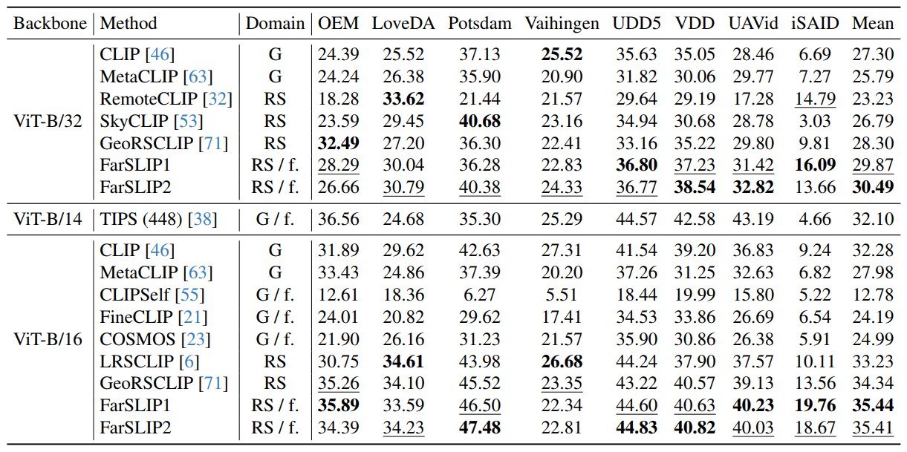

<h1>Open-Vocabulary Semantic Segmentation for Remote Sensing Images</h1>


## Overview

This repository provides an offical evaluation framework for open-vocabulary semantic segmentation (OVSS) in [FarSLIP](https://github.com/NJU-LHRS/FarSLIP).
It benchmarks a variety of vision-language foundation models, covering both general-domain and remote-sensing-specific models, across eight remote sensing datasets.

You can also use this repository to conveniently evaluate your own models (supporting both [OpenCLIP](https://github.com/mlfoundations/open_clip)-based and [LongCLIP](https://github.com/beichenzbc/Long-CLIP)-based architectures), with the flexibility of different customized attention mechanisms in the last attention layer of ViT.


## Preparation

### Installation

1. Clone this repository.

    ~~~shell
    git clone git@github.com:NJU-LHRS/RS-OVSS.git
    cd RS-OVSS
    ~~~

2. Create a new virtual environment.

    ~~~shell
    conda create -n rsovss python=3.10
    conda activate rsovss
    ~~~

3. Install dependences.

    ~~~shell
    bash install.sh 
    ~~~

### Checkpoints
For downloading the FarSLIP checkpoints, please check [here](https://github.com/NJU-LHRS/FarSLIP?tab=readme-ov-file#checkpoints).


### Evaluation datasets
We utilize eight semantic segmentation datasets as used in [SegEarth](https://github.com/likyoo/SegEarth-OV). Detailed instructions for dataset preparation can be found in the "Semantic Segmentation" section of [SegEarth/dataset_prepare.md](https://github.com/likyoo/SegEarth-OV/blob/main/dataset_prepare.md).


## Model evaluation

+ Set the 'test_data_root' in [configs/base_config.py](./configs/base_config.py) to the root directory of your validation dataset.

+ Evaluate FarSLIP or other RS-specific CLIP variants: Set the MODEL_PATHS in [customized_segmentor.py](./customized_segmentor.py) to the paths of your download checkpoint files.

    + Run the evaluation script:
        ```bash
        python eval_customized.py --method $METHOD --vit-type $VIT
        ```
        - `$METHOD` options: `FarSLIP1`, `FarSLIP2`, `RemoteCLIP`, `GeoRSCLIP`, `SkyCLIP`, `LRSCLIP`
        - `$VIT` options: `ViT-B-16`, `ViT-B-32`
        > **Note:** Other parameters will be automatically set according to your assigned `$METHOD` and `$VIT`.

+ Evaluate your own trained model.
    + Run the evaluation script:
        ```bash
        python eval_customized.py --method CLIP --vit-type $VIT --pretrained $PATH_TO_YOUR_MODEL
        ```
        - Optional: Adding `--fqg` to enable **quick_gelu**.
        - Optional: Adding `--long-clip load_from_scratch` to enable **LongCLIP**.

<p align="center">
  
  <br>
  <em>
    OVSS accuracies across RS benchmarks (mIoU, %). G denotes general-domain models, and RS refers to RS-specific models.
    f. indicates models specifically designed with fine-grained optimization. All models use an input image size of 224, except TIPS (448)
  </em>
</p>


<!-- + general-domain VLFMs
+ RS-variants -->


## Citation

~~~tex
@article{li2025farslip,
title={FarSLIP: Discovering Effective CLIP Adaptation for Fine-Grained Remote Sensing Understanding},
author={Zhenshi Li and Weikang Yu and Dilxat Muhtar and Xueliang Zhang and Pengfeng Xiao and Pedram Ghamisi and Xiao Xiang Zhu},
journal={arXiv preprint arXiv:2511.14901},
year={2025}
}
~~~

## Acknowledgement
We gratitude to [SegEarth](https://github.com/likyoo/SegEarth-OV) and [cosmos](https://github.com/ExplainableML/cosmos) for their wonderful works.


